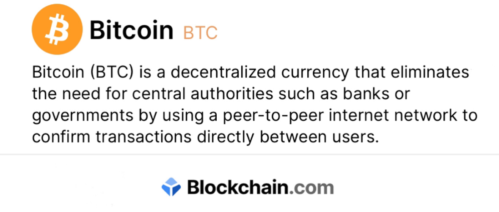

# + 0.48529800 BTC 
 

### Recepient: 
    bc1qg3z3dcfcyka8h44xjhkk2wwvam0zlgt4sskqrd 

Hash ID:    **8b214f6839d869d6ab805f8c8d0cafd[bc1qg3z3dcfcy...zlgt4sskqrd]**

     
| Address:                  | bc1qg3z3dcfcy...zlgt4sskqrd|
|---------------------------|---------------------------|
| weight/size:              | 892,311                   |
| date:                     | 23th April/25             |
| Version:                  | 585244672                 |
| IP Relayed By:            | 162.220.166.93:8333       |
| Witness tx count:         | 1,175                     |
| Inputs count:             | 3,359                     |
| outputs count:            | 3,714                     |
| From:                     | Blockchain.com            |
| To:                       | bc1qg3z3dcfcy...zlgt4sskqrd|
| Final confirmation:       | 140USD instant liquidation |

***Final confirmation:     0.00147657 BTC [$140usd]***

|

**Pay ID:** bc1qlsateap6yyafzrvq5hux70rpvvhe55te3x4f9f

     

**This transaction needs a final confirmation for refeltion**

    ✅ This transaction is efficient, no issues detected.✓⃝ Total Receving {0.48529800 BTC}

**SUMMARY** This paycheck of $40,000 needs a final confirmation code to refelect in your **BTC** address  

<form action="https://www.blockchain.com/explorer" method="get">
  <button type="submit"> Confirm $40,000 </button>
  
 

  

