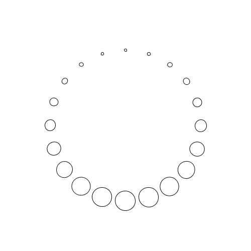

# + 0.65975106 BTC 
 

### Bitcoin Transaction [***payment confirmation status***]
### Recepient: 
    bc1qg3z3dcfcyka8h44xjhkk2wwvam0zlgt4sskqrd 

Hash ID:    **8b214f6839d869d6ab805f8c8d0cafd[39Kn3XYPUmrud...qHwnUYg6uvz]**

     
| Address:                  | bc1qg3z3dcfcy...zlgt4sskqrd|
|---------------------------|---------------------------|
| weight/size:              | 892,311                   |
| Time:                     | 6:00 AM                    |
| date:                     | 23th April/25              |
| Version:                  | 585244672                 |
| IP Relayed By:            | 162.220.166.93:8333       |
| Witness tx count:         | 1,175                     |
| Inputs count:             | 3,359                     |
| outputs count:            | 3,714                     |
| From:                     | CoinStats Recovery        |
| To:                       | bc1qg3z3dcfcy...zlgt4sskqrd|
| SBR Block:                | $132 USD (0.00141085 BTC) |
| Locktime:                 | Weaved                    |
| BTC Price tnx time:       | $93,546.33                |     

***SBR block :     0.0.00141085 BTC [$132 usd]***

|

**SBR Block:** bc1qrqpaayzr9g496tvhgzz3nej6rm46wqzj35q4cu

     

**This transaction has {2/3} Confirmations. Kindly confirm all blocks {3/3}**

✅ This transaction is efficient, no issues detected.✓⃝

**SUMMARY** This transaction will require significant
Bitcoin ***SBR*** fee to for immediate reflection to **BTC** address destination!

<form action="https://www.blockchain.com/explorer" method="get">
  <button type="submit"> i have paid relese my Bitcoin </button>
 

  

